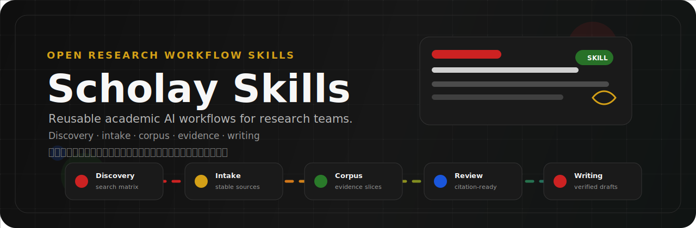

# Scholay Skills



<p align="center">
  <strong>Open academic AI skills for research workflows.</strong><br>
  <span>文献发现、资料接收、语料构建、证据审查与研究写作的开放技能库</span>
</p>

<p align="center">
  <a href="#english">English</a>
  ·
  <a href="#中文">中文</a>
  ·
  <a href="https://www.scholay.com">scholay.com</a>
</p>

---

## English

Scholay Skills is a public collection of reusable academic AI workflow skills maintained by Scholay.

Scholay is building an AI-native academic workspace for literature discovery, evidence management, peer review, LaTeX writing, and research workflows.

### What Is Inside

The public skill directories are released directly at the repository root:

| Skill | Purpose |
| --- | --- |
| [`literature-discovery/`](literature-discovery/) | Build a search matrix, expand seed literature, and maintain an intake queue. |
| [`source-intake/`](source-intake/) | Classify raw research materials before processing. |
| [`corpus-building/`](corpus-building/) | Convert registered source objects into addressable evidence cards. |
| [`evidence-review/`](evidence-review/) | Promote extracted evidence toward citation readiness. |
| [`research-writing/`](research-writing/) | Draft from verified evidence while preserving citation integrity. |

Each directory contains a `SKILL.md` file and, when needed, a `references/` folder with supporting checklists, schemas, and workflow conventions.

### Use

Clone the repository and point your agent or local skill loader at the root-level skill folders:

```bash
git clone git@github.com:scholay/skills.git
cd skills
ls */SKILL.md
```

Use the skill that matches the active research task. For example, use `source-intake` before OCR or corpus extraction, and use `evidence-review` before relying on extracted text as citation-ready evidence.

---

## 中文

Scholay Skills 是 Scholay 维护的开放学术 AI 技能库，用于沉淀可复用的研究工作流。

Scholay 正在构建 AI-native 的学术工作台，覆盖文献发现、证据管理、同行评审、LaTeX 写作与研究协作。

### 仓库内容

公开技能目录直接释放在仓库根目录，不再包在 `skills/` 父目录下：

| 技能 | 用途 |
| --- | --- |
| [`literature-discovery/`](literature-discovery/) | 建立检索矩阵，扩展种子文献，维护待处理文献队列。 |
| [`source-intake/`](source-intake/) | 在处理前对原始研究材料进行分类、登记与稳定命名。 |
| [`corpus-building/`](corpus-building/) | 将已登记的来源对象转换成可索引、可追踪的证据卡。 |
| [`evidence-review/`](evidence-review/) | 将抽取出的证据逐级推进到可引用状态。 |
| [`research-writing/`](research-writing/) | 基于已核验证据进行写作，同时保持引用完整性。 |

每个目录包含一个 `SKILL.md`。需要更完整操作细节时，目录内会附带 `references/`，用于存放检查表、结构 schema 和工作流约定。

### 使用方式

克隆仓库后，直接从根目录读取各个技能目录：

```bash
git clone git@github.com:scholay/skills.git
cd skills
ls */SKILL.md
```

按当前研究任务选择对应技能。例如：OCR 或语料抽取前先使用 `source-intake`，把资料来源稳定下来；写作中要引用抽取文本前，先使用 `evidence-review` 检查证据是否达到可引用标准。

## License

See [`LICENSE`](LICENSE).
